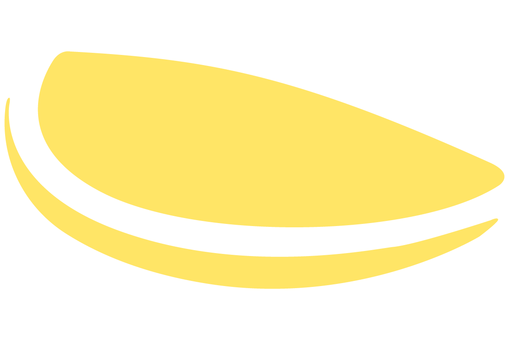

[![Contributors][contributors-shield]][contributors-url]
[![Forks][forks-shield]][forks-url]
[![Stargazers][stars-shield]][stars-url]
[![Issues][issues-shield]][issues-url]

<br />
<p align="center">
  <a href="https://github.com/a-qxin/omelette/">
    
  </a>

  <h3 align="center">Omlet</h3>

  <p align="center">
    A flashcard study app built by students for students. 
    <!-- <br />
    <a href="/">View Demo</a>
    ·
    <a href="https://www.buildconnect.io">BuildConnect</a>
  </p>
</p>

<!-- TABLE OF CONTENTS -->
## Table of Contents

* [About the Project](#about-the-project)
  * [Built With](#built-with)
* [Getting Started](#getting-started)
* [Contact](#contact)
* [Acknowledgements](#acknowledgements)

<!-- ABOUT THE PROJECT -->
## About The Project

[Omlet](https://github.com/a-qxin/omelette/) is a desktop flashcard study app built by students for students.

A team of four students came together via [BuildConnect](https://www.buildconnect.io) to design a study web application that allows students to organize their flashcards in a hierarchical format.

This is an ongoing project.

### Built With

* [React](https://reactjs.org)
* [MongoDB](https://www.mongodb.com)
* [Mongoose](https://mongoosejs.com)
* [React Bootstrap](https://react-bootstrap.github.io)

## Getting Started

To clone a local copy of this repository, use:
```
git clone https://github.com/a-qxin/omelette/
```

## Contact

Project Link: https://github.com/a-qxin/omelette/

* [a-qxin](https://github.com/a-qxin/)

## Acknowledgements

* [BuildConnect](https://www.buildconnect.io)
* [Jason Watmore](https://jasonwatmore.com)'s tutorials


[contributors-shield]: https://img.shields.io/github/contributors/a-qxin/omelette.svg?style=flat-square
[contributors-url]: https://github.com/infinite-options/swag-marketplace/graphs/contributors
[forks-shield]: https://img.shields.io/github/forks/a-qxin/omelette
[forks-url]: https://github.com/a-qxin/omelette/network/members
[stars-shield]: https://img.shields.io/github/stars/a-qxin/omelette
[stars-url]: https://github.com/a-qxin/omelette/stargazers
[issues-shield]: https://img.shields.io/github/issues/a-qxin/omelette
[issues-url]: https://github.com/a-qxin/omelette/issues